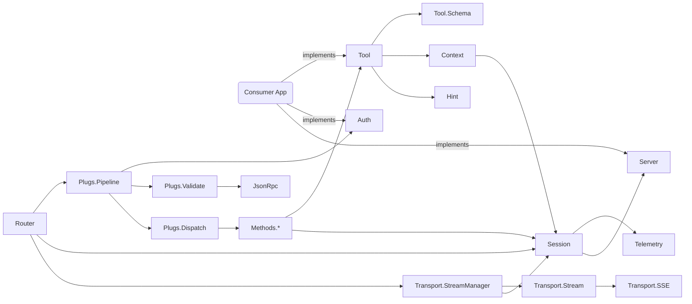

# Wymcp

MCP (Model Context Protocol) server library for Elixir. A Plug-based
implementation of the MCP JSON-RPC 2.0 protocol with support for tools and
optional Bearer token authentication.

Based on [Vancouver](https://github.com/jameslong/vancouver) and inspired by
[anubis-mcp](https://github.com/zoedsoupe/anubis-mcp).

> ### API Changes {: .warning}
> This project is very much a work in progress and the API will change until we reach version 1.0.0.

<div data-toc />

## Getting started

### 1. Add dependency

In `mix.exs`:

```elixir
defp deps do
  [
    {:wymcp, git: "git@github.com:kristiangronberg/wymcp.git", tag: "v0.1.0"}
  ]
end
```

### 2. Create a tool

```elixir
defmodule MyApp.Tools.Calculator do
  use Wymcp.Tool

  @impl true
  def name, do: "calculator"

  @impl true
  def description, do: "Basic arithmetic"

  @impl true
  def actions do
    %{
      add: %{
        description: "Add two numbers",
        properties: %{
          "a" => %{"type" => "number"},
          "b" => %{"type" => "number"}
        },
        required: ["a", "b"],
        defaults: %{}
      }
    }
  end

  @impl Wymcp.Tool
  def run_action(:add, %{"a" => a, "b" => b}) do
    {:ok, %{result: a + b}}
  end
end
```

### 2b. Schema modes and self-documentation (optional)

By default, `Wymcp.Tool` emits a full `oneOf` schema in `tools/list`, giving
MCP clients the complete input contract for every action. For tools with many
actions this can be large (~7-10 KB per tool, ~2000 tokens).

Override `schema_mode/0` to use slim mode instead:

    defmodule MyApp.Tools.Tasks do
      use Wymcp.Tool

      @impl true
      def schema_mode, do: :slim   # ~7x smaller tools/list payload

      # ...
    end

In slim mode, `tools/list` returns a compact schema with an action enum and
one-line descriptions. The LLM discovers details progressively:

**help** — "what can I do?" / "what params does this need?"

    {"action": "help"}                              → summary of all actions
    {"action": "help", "data": {"topic": "create"}} → slim schema (names + types)

**describe** — "tell me everything about this action"

    {"action": "describe", "data": {"topic": "create"}} → full schema + examples

Both actions work in full and slim modes. Additionally, calling an action with
missing required fields returns the action schema in the error response — a
confident LLM can attempt a call and learn from the error without an explicit
help round-trip.

**action_context** — dynamic runtime information

Tools can override `action_context/1` to inject runtime context into any
response — help, describe, or normal action calls:

    @impl Wymcp.Tool
    def action_context(:list) do
      case MyApp.Tasks.count_overdue() do
        0 -> nil
        n -> %{tip: "#{n} tasks overdue — try actionable=true"}
      end
    end
    def action_context(_action), do: nil

When non-nil, the map appears under a `"context"` key in the response.

#### Help vs Describe: what goes where

- **help** is operational: "how to call this action." Schemas, parameter types,
  required fields, and brief tips like "search first to get an ID." Think of it
  as the function signature.
- **describe** is contextual: "what you should know about this domain." Scheduling
  patterns, good Jira filter examples, live runtime context like overdue counts.
  References help for parameter details rather than duplicating. Think of it as
  the doc comment.

In practice: if the information helps the LLM construct a valid call, it goes in
`help`. If it helps the LLM make a better decision about *whether* or *how* to
call, it goes in `describe` (via the `:notes` key in the action schema).

### 2c. Hints (follow-up action suggestions)

Tools can suggest follow-up actions by returning a three-element tuple from
`run_action/2`. The framework calls the `hints/2` callback and injects the
result into the response:

    @impl Wymcp.Tool
    def run_action(:create, %{"name" => name}) do
      task = MyApp.Tasks.create!(name)
      {:ok, %{message: "Created #{name}"}, %{id: task.id}}
    end

    @impl Wymcp.Tool
    def hints(:create, %{id: id}) do
      [
        Wymcp.Hint.new(
          tool: "tasks",
          action: "get",
          description: "View the created task",
          example: %{data: %{id: id}}
        )
      ]
    end

Hints also work with error responses. Return `{:error, reason, hint_context}`
to attach hints to an error:

    def run_action(:delete, %{"id" => id}) do
      case MyApp.Tasks.delete(id) do
        :ok -> {:ok, %{message: "Deleted"}}
        {:error, :not_found} -> {:error, :not_found, %{id: id}}
      end
    end

Every hint is a `Wymcp.Hint` struct with:

- `tool` (required, string) — tool name
- `action` (required, string) — action name
- `description` (required, string) — why this action is relevant
- `example` (optional, map) — example `data` payload

### 3. Add config

In `config.exs`:

```elixir
config :wymcp,
  name: "My MCP Server",
  version: "1.0.0"
```

### 4. Add route

In `router.ex`:

```elixir
forward "/mcp", Wymcp.Router,
  tools: [MyApp.Tools.CalculateSum]
```

### 5. (Optional) Add authentication

Implement the `Wymcp.Auth` behaviour:

```elixir
defmodule MyApp.McpAuth do
  @behaviour Wymcp.Auth

  @impl Wymcp.Auth
  def authenticate(conn) do
    with ["Bearer " <> token] <- Plug.Conn.get_req_header(conn, "authorization"),
         {:ok, user} <- MyApp.Accounts.fetch_user_by_api_token(token) do
      {:ok, Plug.Conn.assign(conn, :current_user, user)}
    else
      _ -> {:error, "Invalid or missing Bearer token"}
    end
  end
end
```

Then pass it in the router:

```elixir
forward "/mcp", Wymcp.Router,
  tools: [MyApp.Tools.CalculateSum],
  auth: MyApp.McpAuth
```

When authentication fails, Wymcp returns HTTP 401 with a `WWW-Authenticate: Bearer`
header per the MCP 2025-11-25 specification.

## Architecture



## Modules

[`Wymcp.Router`](lib/wymcp/router.ex) is the Plug entry point. It accepts
`:tools` (a list of `Wymcp.Tool` modules) and an optional `:auth` module, then
runs the request through JSON parsing, authentication, MCP schema validation,
and method dispatch. Consuming applications forward a route to this module and
do not interact with the internal plug pipeline directly.

[`Wymcp.Tool`](lib/wymcp/tool.ex) is the behaviour that consuming applications
implement to expose capabilities to LLMs. Each tool declares a name, description,
`actions/0` map (schemas), and a `run_action/2` callback. The `use Wymcp.Tool`
macro generates `input_schema/0`, `run/2`, and `definition/0`. Two built-in
actions provide progressive self-documentation: `help` returns action summaries
or slim per-action schemas (names, types, required fields); `describe` returns
the full schema including examples, patterns, and constraints. Override
`schema_mode/0` to return `:slim` for a ~7x reduction in the `tools/list`
payload at the cost of `help`/`describe` round-trips for unfamiliar actions.
The existing `missing_required_fields` error response also returns schema
details, so a confident LLM can often skip explicit `help` calls entirely.
Return `{:error, reason, hint_context}` from `run_action/2` to attach hints to
error responses — the framework calls `hints/2` and `action_context/1` on errors
the same way it does on successes.

[`Wymcp.Hint`](lib/wymcp/hint.ex) is the struct for follow-up action suggestions.
Each hint represents a concrete next action the LLM can take, with a tool name,
action name, description, and optional example payload. The struct validates
required fields at construction time, rejects atoms for `tool` and `action`
(enforcing the JSON wire format), and implements `JSON.Encoder` for serialization.
Tools return hints via the `hints/2` callback, triggered by three-element tuples
from `run_action/2`.

[`Wymcp.Auth`](lib/wymcp/auth.ex) is the behaviour for Bearer token
authentication. Consuming applications implement `authenticate/1` to validate
credentials from the `Authorization` header. When no `:auth` option is provided
to the router, `Wymcp.Auth.Noop` is used as a pass-through. Authentication
failures produce HTTP 401 with `WWW-Authenticate: Bearer` per the MCP spec.

[`Wymcp.JsonRpc`](lib/wymcp/json_rpc.ex) handles JSON-RPC 2.0 envelope
construction and MCP protocol schema validation. It compiles the MCP JSON Schema
(`priv/schema.json`, 2020-12 dialect) at build time using JSV, so incoming
requests are validated against the official protocol definition without runtime
schema parsing.

[`Wymcp.Transport.StreamManager`](lib/wymcp/transport/stream_manager.ex) is the
GenServer that owns the chunked SSE connection for a single MCP session. It runs
under `Wymcp.StreamSupervisor` (a `Task.Supervisor`), sends keepalive comments
on a configurable timer to prevent proxy timeouts, and pushes server-initiated
SSE events when the Session calls `push_event/2`. The StreamManager and Session
monitor each other — if either crashes, the other cleans up. Only one active SSE
stream per session is supported; a new GET replaces the previous stream.

[`Wymcp.Testing`](lib/wymcp/testing.ex) provides test helpers for
consuming applications. Functions like `text_response/1`, `json_response/1`, and
`error_response/1` unwrap MCP response envelopes and assert on content type,
removing boilerplate from tool tests.

## Known issues

### Claude.ai connectors break on server restart

When the wymcp server restarts (deploy, crash, scaling event) while a Claude.ai
Desktop connector has an active session, the connector can enter a corrupted
state where it shows "This connector has no tools available." Attempting to
disconnect produces "Invalid server ID format. Expected UUID or mcpsrv_* tagged
ID."

**Why it happens:** Wymcp sessions are in-memory GenServers. A server restart
destroys all sessions. The MCP spec says clients receiving HTTP 404 for a stale
session ID should re-initialize, but Claude.ai's connector does not recover
automatically — it gets stuck in a limbo state.

**Workaround:** Remove the connector from Claude.ai's config file, restart
Claude.ai, re-add the connector, and restart again.

**Scope:** This is a Claude.ai client-side issue, not a protocol violation.
Wymcp correctly returns 404 for unknown session IDs per the MCP spec. Other MCP
clients (Claude Code, etc.) handle server restarts without issue.
