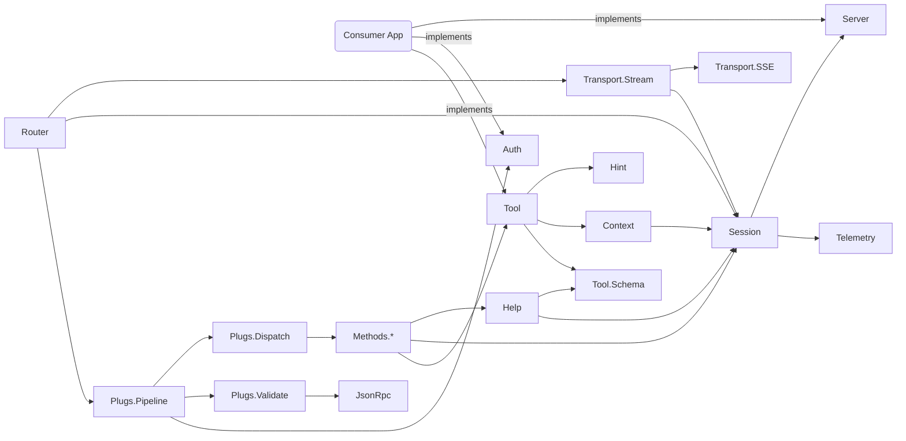

# Wymcp

MCP (Model Context Protocol) server library for Elixir. A Plug-based
implementation of the MCP JSON-RPC 2.0 protocol with support for tools and
optional Bearer token authentication.

Based on [Vancouver](https://github.com/jameslong/vancouver) and inspired by
[anubis-mcp](https://github.com/zoedsoupe/anubis-mcp).

> ### API Changes {: .warning}
> This project is a work in progress and the API will change until we reach version 1.0.0.

<div data-toc />

## Supported MCP protocol versions

Wymcp accepts the three current revisions of the MCP specification.
When a client requests an unknown version, wymcp counter-proposes
its latest supported version per spec (`InitializeResult.protocolVersion`
contains the counter-proposal; the client decides whether to disconnect).

| Version       | Status                  | Notes                                                                                  |
|---------------|-------------------------|----------------------------------------------------------------------------------------|
| `2025-11-25`  | Supported (default)     | Latest. All implemented features available.                                            |
| `2025-06-18`  | Supported               | All implemented features available.                                                    |
| `2025-03-26`  | Supported (floor)       | Tool `title`, `outputSchema` / `structuredContent`, `serverInfo` extensions, elicitation, and the `MCP-Protocol-Version` header are version-gated and omitted on 2025-03-26 sessions. |
| `2024-11-05`  | **Not supported**       | Predates Streamable HTTP and uses a split-endpoint HTTP+SSE transport that wymcp does not implement. Counter-proposed to `2025-11-25` during `initialize`. |

The single source of truth for which versions are accepted and which
features are gated by version is `Wymcp.ProtocolVersion`. The conn-aware
resolver `Wymcp.Session.negotiated_version/1` is what `Methods.Initialize`,
`Methods.ToolsList`, `Methods.ToolsCall`, and `Wymcp.Context.elicit/4`
all consult.

## Getting started

### 1. Add dependency

In `mix.exs`:

```elixir
defp deps do
  [
    {:wymcp, git: "git@github.com:kristiangronberg/wymcp.git", tag: "v0.1.1"}
  ]
end
```

### 2. Create a tool

```elixir
defmodule MyApp.Tools.Calculator do
  use Wymcp.Tool

  @impl true
  def name, do: "calculator"

  @impl true
  def description, do: "Basic arithmetic"

  @impl true
  def actions do
    %{
      add: %{
        description: "Add two numbers",
        properties: %{
          "a" => %{"type" => "number"},
          "b" => %{"type" => "number"}
        },
        required: ["a", "b"],
        defaults: %{}
      }
    }
  end

  @impl Wymcp.Tool
  def run_action(:add, %{"a" => a, "b" => b}, _context) do
    {:ok, %{result: a + b}}
  end
end
```

### 2b. Self-documentation: the help tool

`tools/list` emits a compact schema per tool: an action enum whose
description carries the action summaries, one per line, plus a bare
`data` object. The LLM acts from the summaries and asks for detail only
when it needs it, through the `help` tool that wymcp injects into every
server (the tool name `help` is reserved for it):

    help {}                                     → index of every tool and its actions
    help {"tool": "tasks"}                      → that tool complete (schemas, notes, examples)
    help {"tool": "tasks", "action": "create"}  → one action complete

A wrong `tool` or `action` name errors naming the valid targets. Validation
errors from a normal call also carry the action's schema summary plus a
concrete help pointer — a confident LLM can attempt a call and learn from
the error without a help round-trip.

Schemas answer "how do I call this." The `:notes`, `:related`, and
`:examples` fields on an action schema carry the domain knowledge —
conventions, patterns, warnings the LLM should weigh before calling — and
surface in help's tool and action levels.

**action_context** — dynamic runtime information

Tools can override `action_context/2` to inject runtime context into help's
action level and into normal action responses:

    @impl Wymcp.Tool
    def action_context(:list, _ctx) do
      case MyApp.Tasks.count_overdue() do
        0 -> nil
        n -> %{tip: "#{n} tasks overdue — try actionable=true"}
      end
    end
    def action_context(_action, _ctx), do: nil

When non-nil, the map appears under a `"context"` key in the response.

### 2c. Hints (follow-up action suggestions)

Tools can suggest follow-up actions by returning a three-element tuple from
`run_action/3`. The framework calls the `hints/2` callback and injects the
result into the response:

    @impl Wymcp.Tool
    def run_action(:create, %{"name" => name}, _context) do
      task = MyApp.Tasks.create!(name)
      {:ok, %{message: "Created #{name}"}, %{id: task.id}}
    end

    @impl Wymcp.Tool
    def hints(:create, %{id: id}) do
      [
        Wymcp.Hint.new(
          tool: "tasks",
          action: "get",
          description: "View the created task",
          example: %{data: %{id: id}}
        )
      ]
    end

Hints also work with error responses. Return `{:error, reason, hint_context}`
to attach hints to an error:

    def run_action(:delete, %{"id" => id}, _context) do
      case MyApp.Tasks.delete(id) do
        :ok -> {:ok, %{message: "Deleted"}}
        {:error, :not_found} -> {:error, :not_found, %{id: id}}
      end
    end

Every hint is a `Wymcp.Hint` struct with:

- `tool` (required, string) — tool name
- `action` (required, string) — action name
- `description` (required, string) — why this action is relevant
- `example` (optional, map) — example `data` payload

### 3. Add config

In `config.exs`:

```elixir
config :wymcp,
  name: "My MCP Server",
  version: Mix.Project.config()[:version] || "0.1.0"
```

### 4. Add route

In `router.ex`:

```elixir
forward "/mcp", Wymcp.Router,
  tools: [MyApp.Tools.Calculator]
```

### 5. (Optional) Add authentication

Implement the `Wymcp.Auth` behaviour:

```elixir
defmodule MyApp.McpAuth do
  @behaviour Wymcp.Auth

  @impl Wymcp.Auth
  def authenticate(conn) do
    with ["Bearer " <> token] <- Plug.Conn.get_req_header(conn, "authorization"),
         {:ok, user} <- MyApp.Accounts.fetch_user_by_api_token(token) do
      {:ok, Plug.Conn.assign(conn, :current_user, user)}
    else
      _ -> {:error, "Invalid or missing Bearer token"}
    end
  end
end
```

Then pass it in the router:

```elixir
forward "/mcp", Wymcp.Router,
  tools: [MyApp.Tools.Calculator],
  auth: MyApp.McpAuth
```

When authentication fails, Wymcp returns HTTP 401 with a `WWW-Authenticate: Bearer`
challenge per the MCP 2025-11-25 specification. To complete the OAuth discovery
chain for spec-following clients, append RFC 6750 auth-params — an RFC 9728
`resource_metadata` pointer and a `scope` hint — via the `:www_authenticate`
option:

```elixir
forward "/mcp", Wymcp.Router,
  tools: [MyApp.Tools.Calculator],
  auth: MyApp.McpAuth,
  www_authenticate: [
    resource_metadata: {MyAppWeb.Endpoint, :url, []},
    scope: "mcp"
  ]
```

Values are strings or `{module, function, args}` tuples resolved per request.

## Architecture


```mermaid
flowchart LR
    CA(Consumer App) -->|implements| Tool
    CA -->|implements| Auth
    CA -->|implements| Server

    Router --> Pipeline["Plugs.Pipeline"]
    Pipeline --> Auth
    Pipeline --> Validate["Plugs.Validate"]
    Pipeline --> Dispatch["Plugs.Dispatch"]
    Dispatch --> Methods["Methods.*"]
    Methods --> Tool
    Methods --> Session
    Methods --> Help
    Help --> Session
    Help --> Schema
    Tool --> Schema["Tool.Schema"]
    Tool --> Context
    Tool --> Hint
    Context --> Session
    Router --> Session
    Router --> Stream["Transport.Stream"]
    Stream --> Session
    Stream --> SSE["Transport.SSE"]
    Session --> Telemetry
    Session --> Server

    Validate --> JsonRpc
```

## Consumer-authored text

Wymcp emits consumer-authored text without altering it. Every string a
consuming application writes for the framework to pass on — a tool's
`description()`, an action schema's `:description`, `:notes`, `:related`,
and `:examples`, property `"description"` values, `Wymcp.Hint` descriptions,
and the router's `:instructions` and `:server_info` — reaches the wire
exactly as written. The framework may add separation and structure around
the text: it prefixes each action description with its action name to form
the action summaries (`Wymcp.Tool.Schema.action_summaries/1`), sorts actions
by name, places the summaries in JSON arrays, and joins them with a
separator. It never edits the characters. (Names — tool, action,
property — are identifiers, not prose, and sit outside this contract —
except that an action name is half of every joined summary, so the
newline constraint below covers it too.)

One constraint follows from the separator: neither an action schema's
`:description` nor an action name may contain a newline. The action
enum's description in `tools/list` joins the action summaries with a
newline, a summary is `<action>: <description>`, and an embedded newline
in either half would make the boundary between summaries ambiguous — so
wymcp refuses such a tool at boot (`Wymcp.Router.init/1`) and at runtime
registration (`Wymcp.Session.register_tool/2`) instead of reshaping the
text. No other consumer-authored field is ever joined, so newlines stay
legal everywhere else — including the tool-level `description()` and
`:notes`.

## Modules

[`Wymcp.Router`](lib/wymcp/router.ex) is the Plug entry point. It accepts
`:tools` (a list of `Wymcp.Tool` modules) and an optional `:auth` module, then
runs the request through JSON parsing, authentication, MCP schema validation,
and method dispatch. Consuming applications forward a route to this module and
do not interact with the internal plug pipeline directly.

[`Wymcp.Tool`](lib/wymcp/tool.ex) is the behaviour that consuming applications
implement to expose capabilities to LLMs. Each tool declares a name, description,
`actions/0` map (schemas), and a `run_action/3` callback. The `use Wymcp.Tool`
macro generates `input_schema/0`, `run/2`, and `definition/0`. Dispatch
validates required fields and required-one-of groups and rejects unknown
`data` keys; validation errors return `isError: true` content carrying the
action's schema summary and a concrete `help` pointer, so a confident LLM can
attempt a call and learn from the error. Return `{:error, reason,
hint_context}` from `run_action/3` to attach hints to error responses — the
framework calls `hints/2` and `action_context/2` on errors the same way it
does on successes.

[`Wymcp.Help`](lib/wymcp/help.ex) is the framework-owned introspection tool,
injected by the router into every server under the reserved tool name `help`.
It answers at three levels — a server index, one tool complete, one action
complete — reading the session's effective tool list, and shares its
action-summary content source with the `tools/list` description builder so
the two cannot drift.

[`Wymcp.Context`](lib/wymcp/context.ex) is the `%Context{}` struct passed as the
third argument to every `run_action/3` callback. It carries the session
reference, request metadata, and `assigns` — a merged map of per-request
`conn.assigns` (set by upstream plugs like auth) and per-session state (set by
previous tool calls or during initialization). Session assigns take precedence
on key collisions so accumulated tool state is not overwritten by plug defaults.
Internal wymcp keys are filtered out and not visible in `ctx.assigns`. The
module also provides pure result builders — `text/1`, `json/1`, `image/2`,
`audio/2` — that produce MCP-compliant content arrays for tools to return.
Tools update session-persistent state by returning
`{:ok, content, assigns_updates}`, where the map is merged into the session's
assigns for future requests.

[`Wymcp.Hint`](lib/wymcp/hint.ex) is the struct for follow-up action suggestions.
Each hint represents a concrete next action the LLM can take, with a tool name,
action name, description, and optional example payload. The struct validates
required fields at construction time, rejects atoms for `tool` and `action`
(enforcing the JSON wire format), and implements `JSON.Encoder` for serialization.
Tools return hints via the `hints/2` callback, triggered by three-element tuples
from `run_action/3`.

[`Wymcp.Auth`](lib/wymcp/auth.ex) is the behaviour for Bearer token
authentication. Consuming applications implement `authenticate/1` to validate
credentials from the `Authorization` header. When no `:auth` option is provided
to the router, `Wymcp.Auth.Noop` is used as a pass-through. Authentication
failures produce HTTP 401 with `WWW-Authenticate: Bearer` per the MCP spec.

[`Wymcp.Server`](lib/wymcp/server.ex) is the optional behaviour for hooking into
the MCP session lifecycle. Implement `init/2` to run logic when a session
becomes ready (after the `notifications/initialized` handshake) and
`terminate/2` for shutdown. Both callbacks have working defaults via
`use Wymcp.Server`. There is deliberately no `handle_request/2` callback:
per-request concerns like logging, rate limiting, and metrics belong in Plug
middleware placed before `forward "/mcp", Wymcp.Router`, where they compose
naturally with the rest of the host application's pipeline.

[`Wymcp.Telemetry`](lib/wymcp/telemetry.ex) documents the `:telemetry` events
emitted by Wymcp so consuming applications can attach handlers for monitoring,
logging, and metrics. Events cover the session lifecycle
(`[:wymcp, :session, :start | :expired]`) and tool execution
(`[:wymcp, :tool, :start | :stop | :error]`) with measurements and metadata
suitable for `:telemetry_metrics`.

[`Wymcp.Session`](lib/wymcp/session.ex) is the GenServer that holds state for a
single MCP session: the negotiated protocol version, client and server
capabilities, server config, and per-session assigns. A session is created
during the `initialize` handshake and lives until the client disconnects, sends
DELETE, or the configurable idle timer expires (default 30 minutes). Each
session is its own GenServer rather than an ETS row because sampling and
elicitation require a coordination point between the SSE stream process and
spawned tool tasks. Session IDs are 32-byte URL-safe base64 strings that
satisfy the MCP requirement of visible ASCII characters only.

[`Wymcp.JsonRpc`](lib/wymcp/json_rpc.ex) handles JSON-RPC 2.0 envelope
construction and MCP protocol schema validation. It compiles the MCP JSON Schema
(`priv/schema.json`, 2020-12 dialect) at build time using JSV, so incoming
requests are validated against the official protocol definition without runtime
schema parsing.

[`Wymcp.Response`](lib/wymcp/response.ex) is the lowest-level output module in
the pipeline. Every MCP response — successful tool result, JSON-RPC error, or
auth rejection — flows through `send_json/2`, which preserves any
previously-set HTTP status code and halts the connection so downstream plugs do
not execute after a response is sent.

[`Wymcp.Transport.Stream`](lib/wymcp/transport/stream.ex) is the chunked SSE
connection for one session, run as a receive loop by the GET request process
that owns its socket. It registers with the session before the 200 commits —
a session that died in that window gets a clean 404 — then sends the priming
event and serves pushes and keepalives from the loop. The Session reaches it
only through the module's public API (`push/3`, `replace/1`); every chunk
write happens in the request process, the ownership rule real adapters
(Bandit) enforce. The stream and Session monitor each other — if either
process dies, the other cleans up — and because a request process can
outlive the stream it ran, a stream that ends on a failed write clears its
own registration (`Wymcp.Session.unregister_stream/2`) rather than waiting
for a monitor that will not fire. A new GET replaces the old stream: only
one active SSE stream per session.

[`Wymcp.Transport.SSE`](lib/wymcp/transport/sse.ex) is pure SSE event encoding
per the MCP Streamable HTTP transport specification. No process state, no side
effects — just string formatting that turns a JSON-RPC message and optional
event id into the `id: …\ndata: …\n\n` wire format.

[`Wymcp.Testing`](lib/wymcp/testing.ex) provides test helpers for
consuming applications. Functions like `text_response/1`, `json_response/1`, and
`error_response/1` unwrap MCP response envelopes and assert on content type,
removing boilerplate from tool tests.
